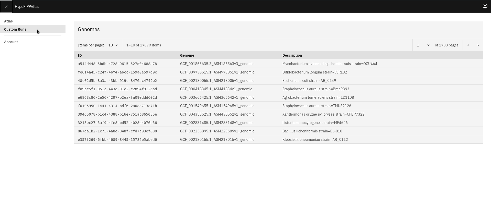
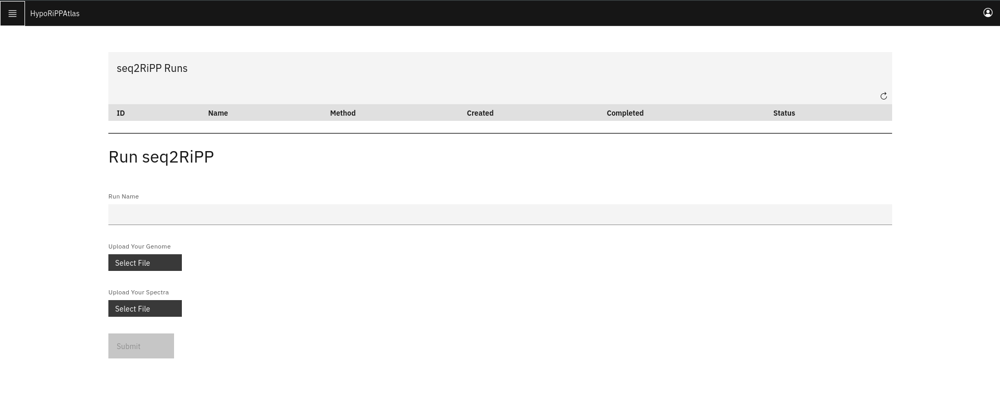
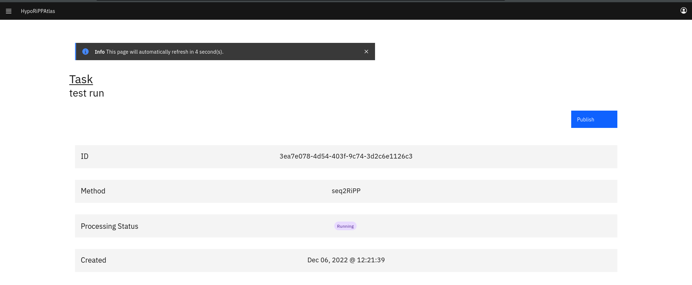
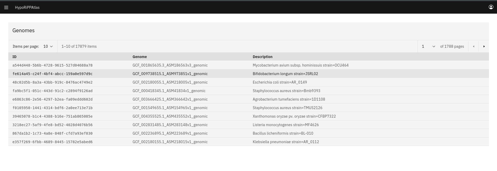
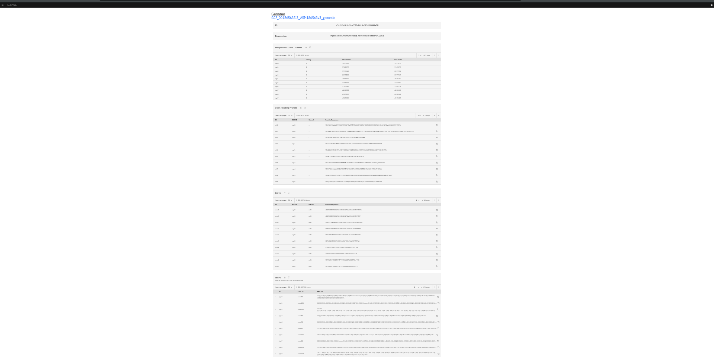
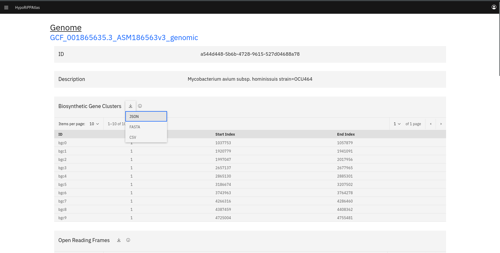
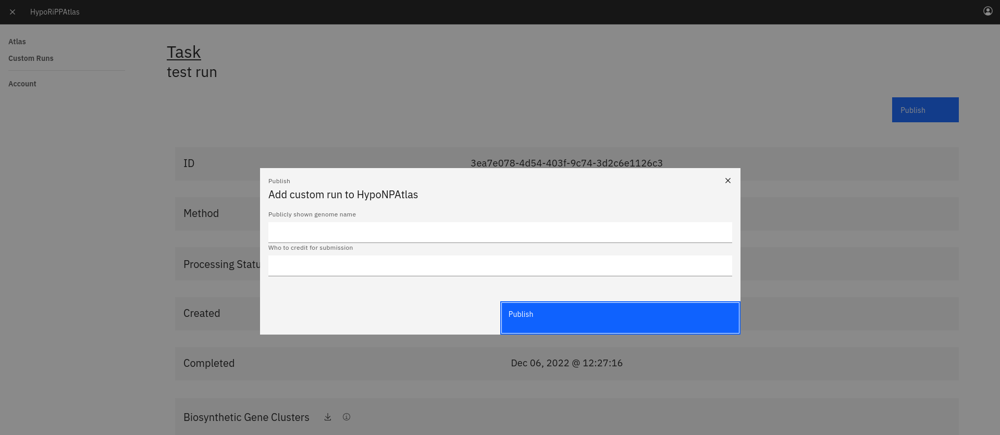

# HypoRiPPAtlas Server

## Introduction
The [HypoRiPPAtlas](https://hyporippatlas.npanalysis.org) server currently includes hypothetical RiPPs from 17,806 complete RefSeq microbial genomes and 77 plant transcriptomes.
Users can browse and download hypothetical BGCs, ORFs, cores, and mature RiPP structure data for any of these genomes.
Additionally, the HypoRiPPAtlas server allows users to upload their own genomic and mass spectrometry data for processing.

## Running seq2ripp on your own data
The seq2ripp pipeline requires paired genomic and mass spectrometry data.
First, you will need to [create a user account](https://hyporippatlas.npanalysis.org/#/signup).

Next, you can navigate to your custom data runs section as show below.

This will bring you to a page with two sections.
First, there is a table with all of your custom runs up to now, it should begin empty.
Second, there is a form to create a new custom run.

To create a new run of seq2ripp
1. Assign a name to your run
2. A FASTA of your complete genome
3. A MGF, mzXML, or mzML of your paired mass spectral data
4. Press "Submit"

After submission you will be redirected to the page for your custom run.
Do not navigate away from this page while it's loading, it will need to upload your data files to our server.
After a moment you will be redirected to the page for your custom run.

This page will refresh automatically every few seconds.
You can feel free to come back to the same URL later, since the custom run URLs are stable.

## Viewing seq2ripp results
The HypoRiPPAtlas is available at <https://hyporippatlas.npanalysis.org>.
It is displayed as a table of the genomes that have been incorporated into the atlas.

Clicking on any row in this table will redirect you to the results for that run.
Each entry in the HypoRiPPAtlas is assigned a unique UUID which determines the stable URL.
For example, Mycobacterium avium has an ID of a544d448-5b6b-4728-9615-527d04688a78 and can be found at
<https://hyporippatlas.npanalysis.org/#/atlas/a544d448-5b6b-4728-9615-527d04688a78>.

The results consist of four tables: theoretical BGCs, theoretical RiPP ORFs, theoretical RiPP cores, and theoretical RiPPs.
Results can be downloaded in JSON or CSV format for any of these tables.
For BGCs, ORFs, and cores results can also be downloaded as a FASTA file.

For custom runs the only difference in the results is that the RiPPs table includes the Dereplicator+ molecule-spectrum matching score between the theoretical RiPP and the best explaining spectrum. This column will be included in JSON and CSV downloads.

## Contributing to the atlas
By default custom runs are completely private to you.
If you would like to contribute runs of seq2ripp on your own data to the public atlas you can use the publish button on the completed task page.

After clicking the blue "Publish" button you must provide a public name for your genome and your own name so that you can be credited as a contributor.

## Reporting Errors
If you run into any error messages or are confused about any aspect of using <https://hyporippatlas.npanalysis.org> please contact mguler@andrew.cmu.edu.
